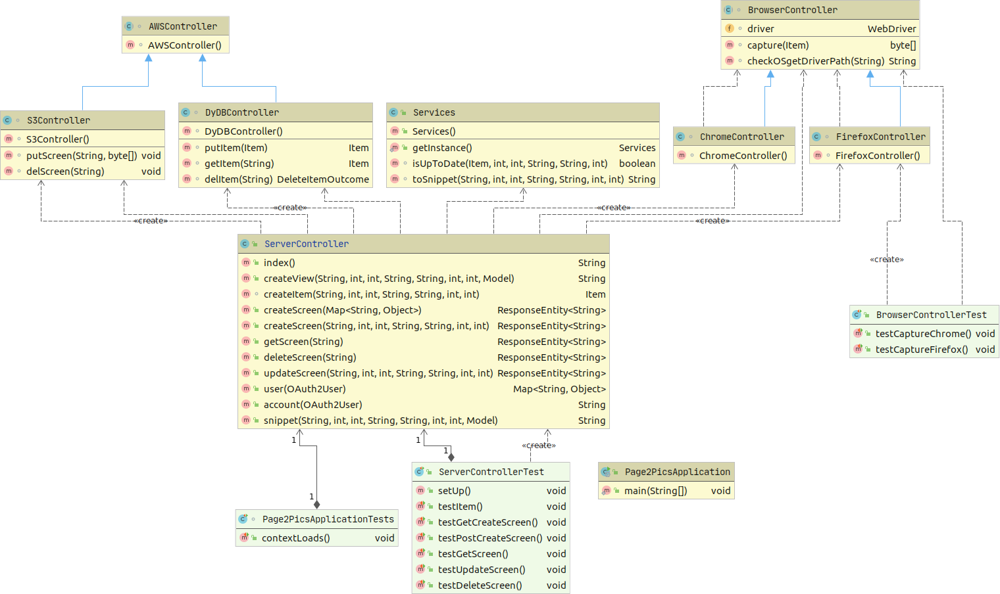

# OO design & UML

The architecture diagram above provides a better way of understanding Page2pics. It shows how Page2pics components link in order to fulfil the requirements.

The green parts represent human stakeholders that interact directly with the application. Rectangular grey shapes represent application classes, with the ServerController in red signifing its importance. External systems, like storage environment and database are also present.

All the requests made by the users on Page2pics website are handled by the ServerController. Depending of the type of request, the serverController class will call the method that handles that specific request. If a new screen is requested, the serverController will first check if the screen with the given parameters exists in the database(via get). If it isn't, a new screenshot item with the parameters taken from the request will be created. ServerController will identify the type of browser sended in the request browser field(via getController method). A firefox or chrome driver object will be created. Then the serverController will call the capture method from browserController which, with the help of the driver will take the screenshot. This will be returned to the serverController which will put the image in the storage environment and the entry with the given parameters in the database. If the requested screen is already in the database, the screen will be returned from the storage environment to the user on Page2pics website via a link. Using the database to store unique urls represents an efficiency feature. Users get a screen much faster if it already exists in the database.

S3Controller and DyDBController are used to provide the necessary functions for the serverController to interact with S3 and DynamoDB.

The image above shows the static UML diagram for all the back-end server-side code so far. Blue arrows represent inheritance. Dotted lines show class creation calls and dependencies.

The ServerController class provides the main logic for our URL screenshot service. There are helper classes, one to control the browser we use to take our screenshot and one to deal with uploading information to AWS infrastructure. Our developer API will accept different types of requests (GET, POST, etc..) to a URL endpoint of the server each with different use cases. These would be to create, get, delete or update a screenshot. Each use case has its own method in the code. There is also a front-end website to advertise the service, sign up or trial the service. For trial purposes there is a method that instead of returning a JSON Object with the screenshot information it will return an HTML page with everything easily readable and it keeps the user on the website for other purposes (e.g.potentially signing up to our service).

From the static UML diagram, it was noticed that a quick change could be done to the BrowserController class that would eliminate a dependency between it and S3Controller class. This helped to reduce refactoring work and errors if there are significant changes to other classes.

.png)

The image above shows a dynamic UML diagram for the method createView() in ServerController. This method is chosen to be modeled as it is one of the crucial methods that the service will be using constantly and shows the calls to the helper classes to capture the screenshot and store the image and related information in AWS’ infrastructure.

To ultimately save the end-user time and our client money the app can provide instant results by reducing the number of new screenshots to take and store if several users request an identical or even similar screenshot. By checking if the parameters match we were able to implement this efficiency feature.

Using dynamic modelling we were able to see where are similarities in the classes and method calls being made. Dynamic modelling is something useful, especially when trying to spot unnecessary repetition as the complexity of the code increases.
