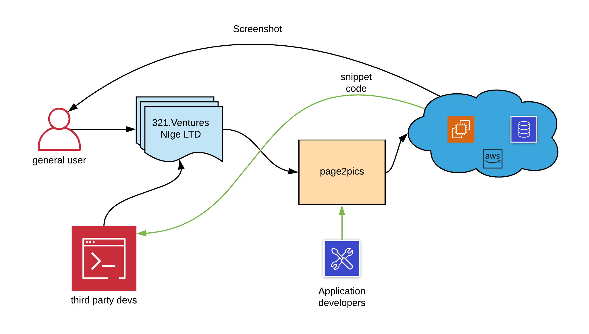
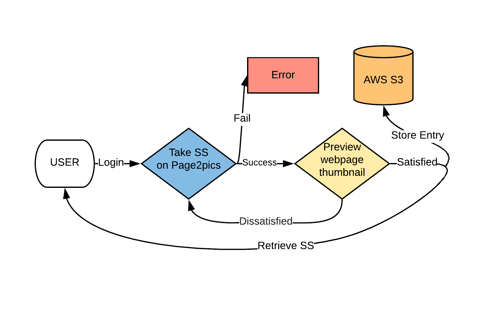
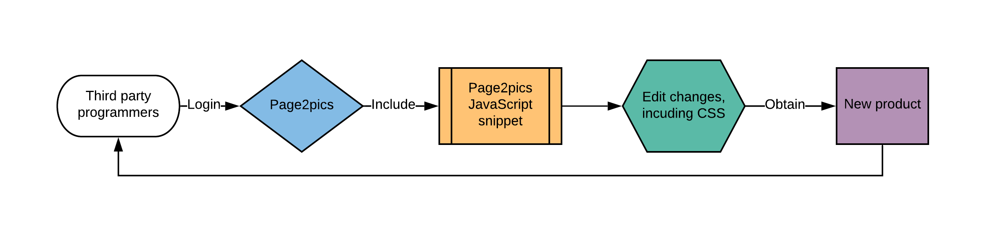

# Requirements
### Stakeholders:
* Application Product Owner - Nigel Hamilton, the founder of Nige LTD, who is responsible for  integrating it as a service on his platform, 321 Ventures.
  - As an application product owner I want to add fast loading thumbnail web page images to my product so that my users have an improved user experience
  - As an application product owner I want my frontend website to be visually appealing so that my users can enjoy my product
  - As an application product owner I want the whole process to be as smooth as possible so that my users are satisfied with the product
* Application Developers - us, the ones who develop the application and are responsible to make sure that it meets the requirements. 
  - As an application developer I want to display web page thumbnails in my application so that the user interface is clear
  - As an application developer I want the option to display web page thumbnails that are up-to-date in my application so that the user does not see old thumbnails
  - As an application developer I want to add web page thumbnails to my application with the minimum effort so that I can add this feature quickly for my users
  - As an application developer I want to ensure the load times for my application are as fast as possible (including image thumbnails) so that I can provide a good UX
* Application Users - those who buy and use the final product.
  - As an application user I want to save my preferred websites so that I can access them quickly later.
  - As an application user I want to see web page thumbnails that are clear and not fuzzy so that I can determine details about the web page at a glance
  - As an application user I want to navigate through the interface quickly and not have to wait long for image thumbnails to load so that I can get my main tasks done
* Third Party Programmer - developer working on their own product that requires usage of web page thumbnail software.
  - As a programmer looking for web page thumbnail software, I want to find a ready made module for my language that I can quickly integrate into my own code base.
  - I want to know that the code performs well so that it is worth integrating it into my own code.
  - I want the module I am integrating to be well documented so that I can easily implement it with my own code.
* Future Application Developers - anyone working on maintaining and improving the software after we hand over the project
  - I want the code to be readable so that I can understand what the code is doing when I come onto the project
  - I want the code to be well documented so that I can find the code features or functionality that I need to quickly
  - I want the code to be modular so that I can add or remove features that I need to in a quick and easy way without affecting the whole project.
* Company (Nige Ltd)
* 321.ventures platform
* Other companies and their staff (Depending on which companies buy the product from Nige Ltd)
* All the other competitors (Those who have already had a similar product. They can influence the market (Nige Ltd can lose or win clients))
* Any third parties
* Cloud Provider (Amazon)

### Core-set of use-case goals
Application users want to:
1. Save their preferred website
2. See web page thumbnails that are clear and not fuzzy
3. Navigate through the interface quickly and not having to wait long for image thumbnails to load
4. Easily integrate the snippet into their webpage

Goal 1.​ ​ Save their preferred website
1. Users find a web page they want a screenshot of

2. Users copy the url of the specific web page

3. Users paste the url in the specified slot on Page2Pics’s website

4. Users edit the configurations for the screenshot

5. Users press the button for taking the screenshot

    ​	Exceptional flow:

    ​			a. User types malicious code instead of the url or other parameters

    ​			b. The user presses the button for taking the screenshot

    ​			c. The webpage displays an error message

    ​			d. The user has to type  the correct url again.

6. Driver renders the screenshot thumbnail on the website

7. The image thumbnail appears on the website

    ​		     a. The image is stored on Amazon S3

8. Users request the image with the specified properties 

9. Users receive the link to the requested image

Goal 2.​ ​ See web page thumbnails that are clear and not fuzzy
1. Users find a web page they want a screenshot of
2. Users copy the url of the specific web page
3. Users paste the url in the specified slot on Page2Pics’s website
4. Users edit the configurations for the screenshot
5. Users press the button for taking the screenshot
6. Driver renders the screenshot thumbnail on the website
7. The image thumbnail appears clearly on the website

Goal 3.​ ​ Navigate through the interface quickly and not having to wait long for image
thumbnails to load
1. Users find a web page they want a screenshot of

2. Users copy the url of the specific web page

3. Users paste the url in the specified slot on Page2Pics’s website

4. Users edit the configurations for the screenshot

5. Users press the button for taking the screenshot

6. The screenshot is already in the database and it is handed over to the app.

7. User can see the image in the designated space on the website in milliseconds

   ​		Alternative Flow:

   ​				a. The screenshot is not in the database or it has expired

   ​				b. The driver renders the webpage and takes the screenshot

   ​				c. The screenshot is uploaded to the database

   ​				d. The screenshot appears on the website

Goal 4. Easily integrate the snipped into their webpage

1. Users find a web page they want a screenshot of
2. Users copy the url of the specific web page
3. Users paste the url in the specified slot on Page2Pics’s website
4. Users edit the configurations for the screenshot
5. Users press the button for taking the screenshot
6. The screenshot is already in the database and it is handed over to the app.
7. Users click on the ``download > snippet`` on the top navbar
8. The snippet is generated and ready to be incorporated in their website

### Main goal: Save their preferred website 
#### Functional and <u>non-functional (underlined)</u> requirements

* <u>ACCESSIBILITY 1</u> - The application server must be running
* <u>ACCESSIBILITY 2</u> - The user must have Internet connection
* <u>ACCESSIBILITY 2.1</u> - The user must have a compatible web browser (Chrome, Firefox, IE8 and above)
* <u>ACCESSIBILITY 3</u> - The web page must be accessible for the app (i.e. cant't be hosted on localhost)
* <u>PERFORMANCE 1</u> - The app should use a database as a cache 
* <u>PERFORMANCE 2</u> - The screenshot should appear in less than 5 seconds after the user's request
* <u>PERFORMANCE 3</u> - At least 50 users should be able to take screenshots at the same time, without significant performance drops.
* CORRECTNESS 1 - The screenshots in the database must have an expiry date and the user must not receive expired screenshots
* CORRECTNESS 2 - If the user changes any parameter against what is already in the database, the app must take the screenshot again with the new parameters.
* PREFERENCES 1 - The app must take screenshots in accordance to user's preferences (height, width, delay, expiry date)
* PREFERENCES 2 - The app should allow the user to choose the rendering driver (Firefox or Chrome)
* SECURITY 1 - The app should display an error message if the user types anything else than what it is expected (i.e. he types malicious code in the url box)
* SNIPPET 1 - The users should be able to download an easily integrated snippet to put on their website (i.e. they might want to use the screenshots as thumbnails)
* SNIPPET 1.1 - The auto-generated snippet must take the screenshot in accordance to user's preferences
* SNIPPET 2 - The preferences should be already included in the snippet code once the user pressed the button for taking the screenshot